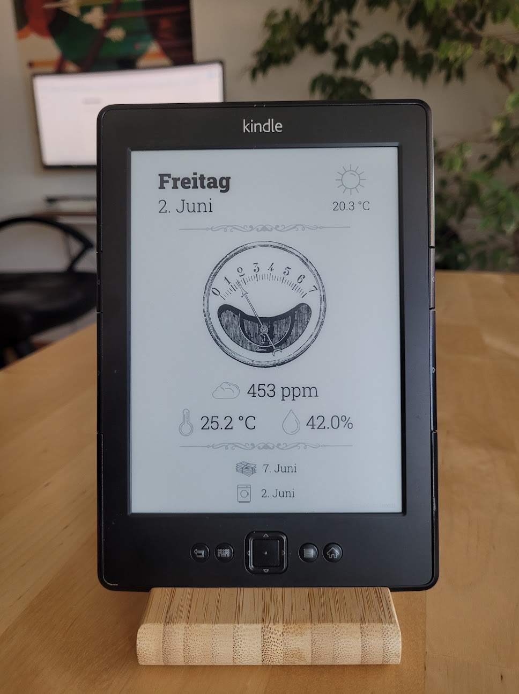
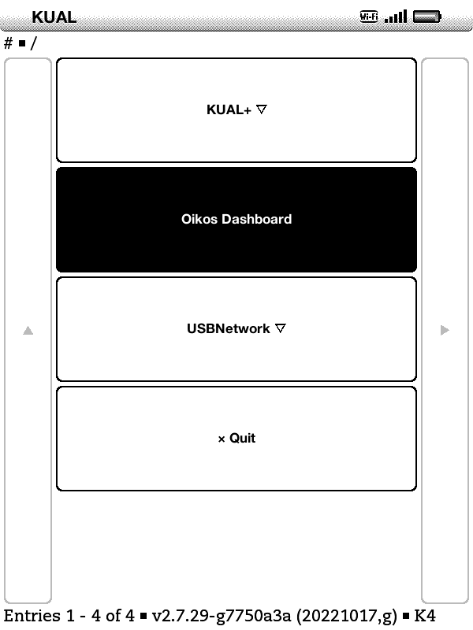

# Oikos Dashboard

Oikos is a customizable dashboard for embedded Linux devices, such as the
Amazon Kindle. It retrieves the displayed information via a [Rhai](https://rhai.rs)
script and renders the resulting SVG into a Linux framebuffer or a PNG file.

## Screenshots



## Usage

### Running the example script

The `example/` folder contains an example template and script. To render the
example dashboard, run the following command:

```
cargo run -- example/template.svg --script example/script.rhai --image example/output.png
```

This will load the `template.svg` file from the the `example` folder as a
template, fill it in with the instructions provided by the `example/script.rhai`
script, and render the final result as a PNG image into `example/output.png`:


### Command-line arguments

```usage
Usage: (--image FILE | --framebuffer [--framebuffer-device DEVICE] [--framebuffer-eink-refresh N])
[--script FILE] [--sleep DURATION [--suspend] [--wakeup-rtc DEVICE] [--exit-on-keypress KEY...
[--exit-on-keypress-devices PATTERN]]] [--wait-for-network URL [--wait-for-network-timeout DURATION]]
[--resources DIR] [--fonts DIR] [--system-fonts] <TEMPLATE>

Available positional items:
    <TEMPLATE>  SVG file to be displayed

Available options:
  Output:
        --image <FILE>   [env:OIKOS_IMAGE: N/A]
                         Write resulting image to PNG file
        --framebuffer    [env:OIKOS_FRAMEBUFFER: not set]
                         Render resulting image into Linux framebuffer
        --framebuffer-device <DEVICE>  [env:OIKOS_FRAMEBUFFER_DEVICE: N/A]
                         Framebuffer device to be used (default: /dev/fb0)
        --framebuffer-eink-refresh <N>  [env:OIKOS_FRAMEBUFFER_EINK_REFRESH: N/A]
                         Refresh e-ink backed framebuffers every N updates (default: 5)

  Scripting:
        --script <FILE>  [env:OIKOS_SCRIPT: N/A]
                         Script used to modify the template before rendering

  Sleep:
        --sleep <DURATION>  [env:OIKOS_SLEEP: N/A]
                         Sleep and refresh image with this interval
        --suspend        [env:OIKOS_SUSPEND: not set]
                         Suspend to RAM while sleeping
        --wakeup-rtc <DEVICE>  [env:OIKOS_WAKEUP_RTC: N/A]
                         RTC device to wake-up while suspended (default: /dev/rtc0)
        --exit-on-keypress <KEY>  [env:OIKOS_EXIT_ON_KEYPRESS: N/A]
                         List of keys which will cause the program to exit when sleeping
        --exit-on-keypress-devices <PATTERN>  [env:OIKOS_EXIT_ON_KEYPRESS_DEVICES: N/A]
                         Input devices to check for exit keypresses

  Network:
        --wait-for-network <URL>  [env:OIKOS_WAIT_FOR_NETWORK: N/A]
                         Wait for connectivity to this HTTP endpoint after standby
        --wait-for-network-timeout <DURATION>  [env:OIKOS_WAIT_FOR_NETWORK_TIMEOUT: N/A]
                         Timeout for network connectivity check

        --resources <DIR>  [env:OIKOS_RESOURCES: N/A]
                         Directory used for resolving relative paths
        --fonts <DIR>    [env:OIKOS_FONTS: N/A]
                         Load fonts from this directory
        --system-fonts   [env:OIKOS_SYSTEM_FONTS: not set]
                         Search for additional fonts in system directories
    -h, --help           Prints help information
```

<!-- Update the above section with the following command:
awk -i inplace '/^```usage/ { print; system("cargo run --quiet -- --help"); c=1; next} /^```/{c=0} c==0{print}' README.md
-->

**Note:** Instead of passing in options as command-line arguments, you may
specify them as environment variables, either directly or using a `.env` file
in your working directory. See `env-sample.kindle` for a more complex example.

### Debug Logging

Setting `RUST_LOG=oikos=debug` will print additional debug information.

## KUAL Extension for Kindle

This repository contains a
[KUAL extension](https://www.mobileread.com/forums/showthread.php?t=203326)
for use with a
[jail-broken](https://wiki.mobileread.com/wiki/Kindle_Hacks_Information)
Amazon Kindle.

Use the following instructions to install Oikos on a jail-broken
Kindle.

  1. Create an `oikos` folder in your USB mass storage root (`/mnt/us/` via SSH).
     The following instructions refer to this newly folder as `$BASEDIR`, e.g.
     `BASEDIR="/mnt/us/oikos"`
  2. Copy the `oikos` armv7hf binary into `$BASEDIR`
  3. Copy the contents of the `example/*` into `$BASEDIR`, e.g.
     `cp -vr example/{script.rhai,template.svg,fonts} "$BASEDIR"`
  4. Copy and rename the `env-kindle.sample` file to `$BASEDIR/.env`, e.g.
    `cp env-kindle.sample "$BASEDIR/.env"`
  5. Copy the KUAL extension from the `kual/` folder into the `extensions` folder
     in your USB mass storage root, e.g. `cp -r kual/oikos /mnt/us/extensions/`



## Supported Devices

 - [Amazon Kindle 4 Non-Touch](https://wiki.mobileread.com/wiki/Kindle4NTHacking)
 - Generic Linux 2.6.31+ devices
